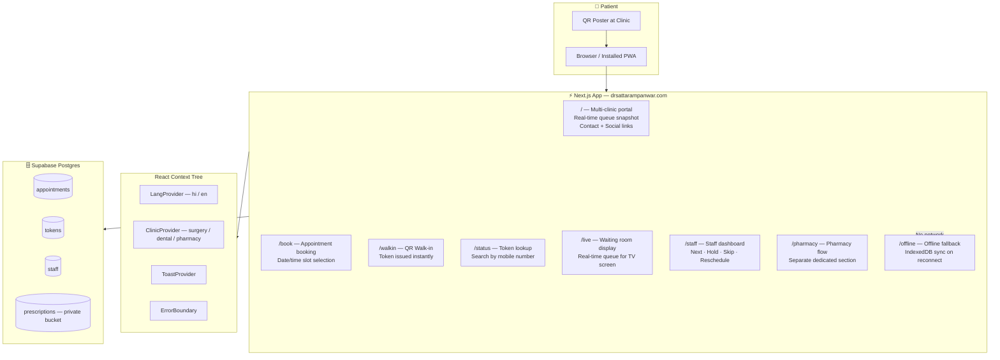

<div align="center">

# 🏥 Panwar Health Care — Smart Queue PWA

### Production healthcare system handling **100+ daily patients**

**Hindi-First · Offline-Safe · Multi-Clinic · Installable PWA**

[](https://nextjs.org/)
[](https://www.typescriptlang.org/)
[](https://supabase.com/)
[](https://tailwindcss.com/)
[](https://web.dev/progressive-web-apps/)
[](https://drsattarampanwar.com)

[**🚀 Live → drsattarampanwar.com**](https://drsattarampanwar.com)

</div>

---

## 🎯 Real-World Impact

This is not a demo. This is a **production system actively used at Panwar Health Care, Jaisalmer, Rajasthan**:

- 👨‍⚕️ **Dr. Satta Ram Panwar** — Advance Laparoscopic, Gastro & Trauma Specialist Surgeon (MBBS MS FMAS ATLS)
- 🏥 **3 clinics on one URL**: Surgical · Dental (Dhandev Dental) · Pharmacy (Dhanwantri Medical)
- 📊 **100+ patients per day** — queue tokens issued, appointments booked, live status viewed
- 📱 **Installable as a mobile app** — patients add it to their phone home screen

---

## ✨ Patient Experience

A patient arriving at Dr. Panwar's clinic:

1. **Sees the QR poster at the entrance** → scans it → opens `drsattarampanwar.com`
2. **Taps "आज का टोकन लें"** (Get Today's Token) → token issued in under 10 seconds
3. **Gets SMS / on-screen token number** → knows exactly when to come in
4. **Checks "मेरा लाइव टोकन"** (Live Queue) → real-time position without asking staff
5. **Zero phone calls to staff. Zero paper tokens. Zero confusion.**

---

## 🏗️ Technical Architecture



---

## 🎨 Design System

The app uses a **custom CSS token system** (not raw Tailwind utilities) for consistent, clinic-appropriate aesthetics:

```css
/* Accent palette — calming healthcare green */
--accent:          #0f6b63;
--accent-strong:   #00514b;
--accent-soft:     rgba(15, 107, 99, 0.08);
--accent-deep:     #0a4e53;

/* Semantic tokens */
--line:            rgba(19, 49, 58, 0.08);   /* borders */
--success:         #49b56d;

/* Surface */
background: rgba(247, 239, 225, 0.88);  /* warm off-white — not clinical white */
```

**Typography stack (3 fonts, all preloaded):**
- `Plus Jakarta Sans` — headings, UI chrome
- `Outfit` — numeric displays (queue numbers, counts)
- `Noto Sans Devanagari` — Hindi text rendering

Why three fonts? Hindi and Latin scripts have different vertical metrics. A single font that handles both well doesn't exist. This stack renders **"आज का टोकन लें"** and **"Advance Laparoscopic Surgeon"** both beautifully.

---

## 🧩 Component Architecture

```
src/
├── app/
│   ├── layout.tsx              # Provider tree: Lang → Toast → ErrorBoundary → ClinicProvider
│   ├── page.tsx                # Main portal (31KB) — full clinic homepage
│   ├── loading.tsx             # Skeleton loading state
│   ├── manifest.ts             # PWA manifest — installable on iOS + Android
│   ├── book/                   # Appointment booking flow
│   ├── walkin/                 # QR walk-in token issuance
│   ├── status/                 # Queue status lookup by mobile
│   ├── staff/                  # Staff management dashboard (PIN protected)
│   ├── live/                   # Waiting room display screen
│   ├── poster/                 # Printable QR poster generator
│   ├── pharmacy/               # Pharmacy-specific flow (dedicated route)
│   ├── offline/                # Offline fallback page
│   └── globals.css             # Custom design token system (16KB)
│
├── features/
│   └── clinic/                 # Feature-Sliced domain logic
│
├── components/
│   ├── Navbar.tsx              # Sticky header with clinic switcher + Online badge
│   ├── PwaShell.tsx            # PWA installation wrapper
│   ├── StaffBottomNav.tsx      # Staff-specific bottom navigation
│   └── PatientBottomNav.tsx    # Patient-specific bottom navigation
│
├── lib/
│   ├── supabase.ts
│   └── offlineDb.ts            # IndexedDB sales queue
│
└── i18n/                       # Hindi (hi) + English (en) translations
```

---

## 🔑 Multi-Clinic Architecture

One URL, three independent clinics — switched via URL param or navbar tabs:

| Clinic | Param | Domain |
|--------|-------|--------|
| Dr. Satta Ram Panwar (Surgery) | `?clinic=surgery` | Surgical & Laparoscopic |
| Dhandev Dental Clinic | `?clinic=dental` | Dental |
| Dhanwantri Medical & Provision | `?clinic=pharmacy` | Pharmacy |

The `ClinicProvider` context reads the `clinic` param and provides:
- Clinic-specific branding, colors, doctor info
- Separate Supabase queue tables per clinic
- Separate staff PINs per clinic
- Separate `/live` queue displays

---

## 📱 PWA Features

The app installs as a native-like app:

```typescript
// manifest.ts
{
  name: "Dr SR Panwar Clinic",
  short_name: "Dr SR Panwar",
  display: "standalone",           // No browser chrome when installed
  theme_color: "#0f6b63",
  background_color: "#f7efe1",
  icons: [logo.png at 512×512]
}
```

**iOS support:**
- `apple-mobile-web-app-capable: yes`
- `apple-mobile-web-app-status-bar-style: black-translucent`
- `apple-touch-startup-image` configured

Patients in Jaisalmer add this to their home screen → looks and feels like a native app.

---

## 🌐 Live Routes

| Route | Purpose | Auth |
|-------|---------|------|
| `/?clinic=surgery\|dental\|pharmacy` | Multi-clinic portal | Public |
| `/book?clinic=...` | Appointment booking | Public |
| `/walkin?clinic=...` | QR walk-in token | Public |
| `/status?clinic=...` | Token lookup by mobile | Public |
| `/live?clinic=...` | Waiting room display | Public |
| `/staff?clinic=...` | Staff management | PIN |
| `/poster?clinic=...` | Printable QR poster | Public |
| `/pharmacy` | Pharmacy-specific flow | Public |
| `/offline` | Offline fallback | Public |

---

## 🌍 Offline Behaviour

Patients booking appointments in areas with poor connectivity:

```
Form Submit
     │
     ▼
  Network OK? ──Yes──→ Supabase write → Confirm
     │
     No
     ▼
  Save to IndexedDB (provisional entry)
  Show: "सहेजा गया — जब नेटवर्क आए, अपडेट होगा"
     │
     ▼ (on reconnect)
  Background sync → Supabase
  Entry confirmed
```

---

## 🚀 Local Setup

```bash
git clone https://github.com/kuldeeppanwar02/DrSrpanwar.git
cd DrSrpanwar
npm install

# Configure environment
cp vercel.env .env.local
# Fill in values from your Supabase project

# Setup database
# Open Supabase SQL Editor → run supabase/schema.sql

npm run dev
```

### Environment Variables

```env
# Public
NEXT_PUBLIC_SUPABASE_URL=https://your-project.supabase.co
NEXT_PUBLIC_APP_BASE_URL=http://localhost:3000

# Server-only
SUPABASE_SERVICE_ROLE_KEY=your-service-role-key
SUPABASE_DATABASE_URL=postgresql://...
SUPABASE_STORAGE_BUCKET=prescriptions
STAFF_SESSION_SECRET=your-secret-min-32-chars

# Clinic PINs
DOCTOR_PIN_SURGERY=xxxx
DOCTOR_PIN_DENTAL=xxxx
PHARMACY_PIN=xxxx
```

---

## 📦 Tech Stack

| Layer | Technology |
|-------|-----------|
| Framework | Next.js 15+ (App Router, React 19) |
| Language | TypeScript 5 |
| Styling | Tailwind CSS 4 + Custom CSS Design Tokens |
| Database | Supabase Postgres + Storage |
| Auth | Server-signed PIN sessions (httpOnly cookie) |
| Offline | IndexedDB via `offlineDb.ts` |
| i18n | Custom LangProvider (Hindi + English) |
| Fonts | Plus Jakarta Sans · Outfit · Noto Sans Devanagari |
| PWA | manifest.ts + Apple meta tags |
| SEO | Google Search Console verified |
| Deployment | Vercel (drsattarampanwar.com) |

---

<div align="center">

**Serving 100+ patients daily at Panwar Health Care, Jaisalmer, Rajasthan.**

[**Visit Live →**](https://drsattarampanwar.com) · [Report Bug](https://github.com/kuldeeppanwar02/DrSrpanwar/issues)

*Designed & Developed by [Kuldeep Panwar](https://github.com/kuldeeppanwar02)*

</div>
